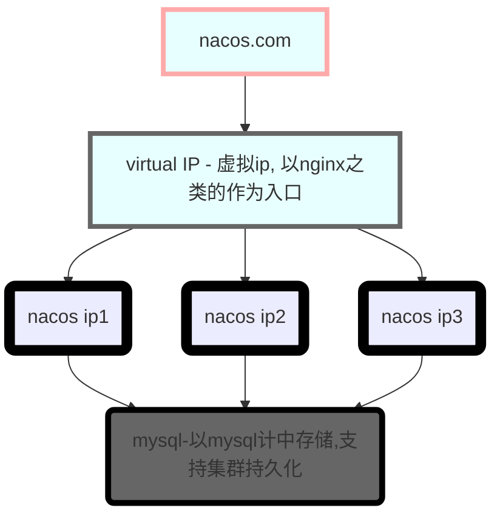

# Nacos (Naming,Configuration,Service)

> Eureke + Config + Bus

一个更易于构建云原生应用的动态服务发现，配置管理和服务管理平台

## 下载与安装

- 下载地址：github/nacos
- 安装： bin目录下 (startup.cmd)

## 服务注册

### 父依赖添加
```xml
<dependency>
    <groupId>com.alibaba.cloud</groupId>
    <artifactId>spring-cloud-alibaba-dependencies</artifactId>
    <version>2.1.0.RELEASE</version>
    <type>pom</type>
    <scope>import</scope>
</dependency>
```

### Nacos依赖添加
```xml
<dependency>
    <groupId>com.alibaba.cloud</groupId>
    <artifactId>spring-cloud-starter-alibaba-nacos-discovery</artifactId>
</dependency>
```

### 服务提供者实例
yaml文件
```yaml
server:
  port: 9001

spring:
  application:
    name: nacos-payment-provider
  cloud:
    nacos:
      discovery:
        server-addr: localhost:8848

management:
  endpoints:
    web:
      exposure:
        include: '*'
```

业务文件
```java
@RestController
@RequestMapping("/nacos/provider")
public class PaymentController {

    @Value("${server.port}")
    private String port;

    @GetMapping(value = "/getId/{id}")
    public String getPayment(@PathVariable("id") Integer id) {
        return "nacos registry, serverport : " + port + "\t" + id;
    }

}
```

### 服务消费者实例

yaml文件
```yaml
server:
  port: 9011

spring:
  application:
    name: nacos-order-consumer
  cloud:
    nacos:
      discovery:
        server-addr: localhost:8848

service-url:
  nacos-user-service: http://nacos-payment-provider

```

业务文件
```java
@RestController
@Slf4j
@RequestMapping("/nacos/consumer")
public class OrderNacosController {

    @Resource
    private RestTemplate restTemplate;

    @Value("${service-url.nacos-user-service}")
    private String serverUrl;

    @GetMapping("/getId/{id}")
    public String paymentInfo(@PathVariable("id") Integer id) {
        return restTemplate.getForObject(serverUrl+"/nacos/provider/getId/" + id, String.class);
    }
}

```

## 服务配置

### 工程编码
pom
```xml
<dependency>
    <groupId>com.alibaba.cloud</groupId>
    <artifactId>spring-cloud-starter-alibaba-nacos-config</artifactId>
</dependency>

<dependency>
    <groupId>com.alibaba.cloud</groupId>
    <artifactId>spring-cloud-starter-alibaba-nacos-discovery</artifactId>
</dependency>
```

yaml
```yaml
### bootstrap.yml

server:
  port: 3377
spring:
  application:
    name: nacos-config-client
  cloud:
    nacos:
      discovery: # 服务注册
        server-addr: localhost:8848
      config: # 服务配置
        server-addr: localhost:8848
        file-extension: yaml # 指定为yaml格式的配置


### application.yml

spring:
  profiles:
    active: dev
```

业务类
```java
@RestController
@RefreshScope // 动态刷新
public class ConfigClientController {
    @Value("${config.info}")
    private String configInfo;

    @GetMapping("/config/info")
    public String getConfigInfo() {
        return configInfo;
    }
}
```

### Nacos配置添加

dataid 为 `${prefix}-${spring.profile.active}.${file-extension}`

- ${prefix} ：默认为 spring.application.name 的值，也可以通过配置项 spring.cloud.nacos.config.prefix来配置
- ${spring.profile.active} ：为当前环境对应的 profile, 当 spring.profile.active 为空时，对应的连接符 - 也将不存在，dataId 的拼接格式变成 ${prefix}.${file-extension}
- ${file-extension} ：file-exetension 为配置内容的数据格式，可以通过配置项 spring.cloud.nacos.config.file-extension 来配置。目前只支持 properties 和 yaml 类型

### 多环境多项目管理

Namespace + Group + DataID 3层配置

- Group ：spring.cloud.nacos.config.group
- Namespace ：spring.cloud.nacos.config.namespace

## Nacos持久化配置

Nacos持久化默认内嵌了derby数据库，支持mysql数据库

- `nacos/conf/nacos_mysql.sql` 在自己的mysql数据库中执行此脚本。
- `nacos/conf/application.properties` 修改其配置，添加：
    ```properties
    nacos.istio.mcp.server.enabled=false
    
    spring.datasource.platform=mysql
    db.num=1
    db.url.0=jdbc:mysql://11.162.196.16:3306/nacos_devtest?characterEncoding=utf8&connectTimeout=1000&socketTimeout=3000&autoReconnect=true
    # 此为mysql8
    # db.url.0=jdbc:mysql://localhost:3306/nacos_devtest?useUnicode=true&useJDBCCompliantTimezoneShift=true&useLegacyDatetimeCode=false&serverTimezone=UTC
    db.user=root
    db.password=123456
    ```
- **注意，nacos1.1.4不支持mysql8**，但网上有修改支持后的资源。

## Nacos集群化配置



### 端口修改

1. 修改startup.sh,修改其脚本，添加参数p(端口处理),启动时：`startup -p 8848`
2. 修改application。properties中的配置 `server.port=8848`

### 集群化配置步骤

1. Nacos端口配置
    1. 修改startup.sh,修改其脚本，添加参数p(端口处理),启动时：`startup -p 8848`
    2. 修改application。properties中的配置 `server.port=8848`
2. Nacos使用mysql持久化。
3. 配置cluster.conf,集群端口梳理
    ```text
    # 例如：
    192.168.111.143:3333
    192.168.111.143:3333
    192.168.111.143:3333
    ```
4. nginx配置，mysql配置
5. 启动nginx，启动所有的Nacos服务